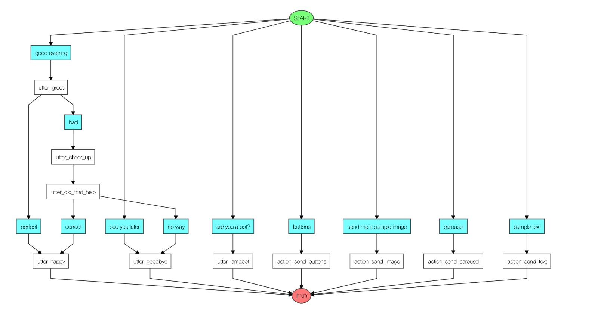
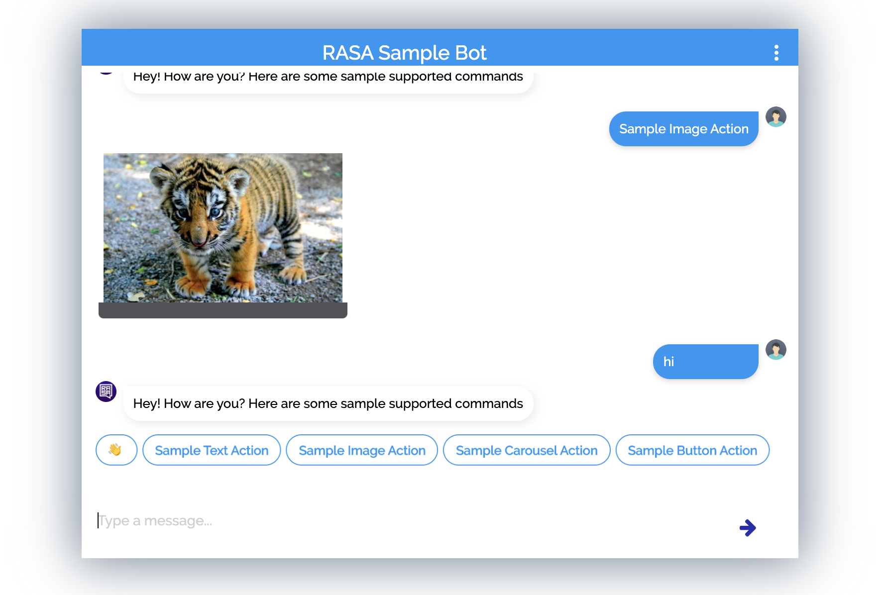
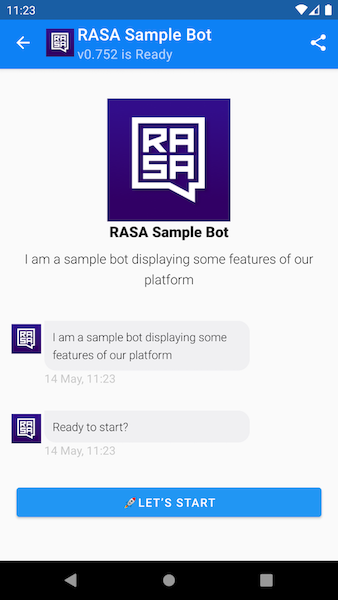

# A sample RASA chatbot template for MACHAAO Mini Apps Messaging Platform

This RASA based Sample NLU chatbot intends to showcase various RCS-esque messaging options available on the Machaao Platform

The intent of the document is to provide with a quick and fast development setup guide for python developers looking to develop deeply personalized chat bots.




## Web SDK Demo ##
A [RASA sample web demo](https://ganglia-dev.machaao.com/rasa.sample) has been made available for testing purposes



## Get your FREE API Key ##
* You can acquire a FREE API Key via https://messengerx.io 
or by [emailing us](mailto:connect@machaao.com) and replace it in the config/credential.yml
```
connectors.MachaaoConnector.MachaaoInputChannel:
    api_token: <YOUR API-TOKEN>
    base_url: "https://ganglia-dev.machaao.com"
```

* You can run the code as it is, and it will use the provided Sample Token.

## Android Sample App Screenshot ##
Screenshot of the sample RASA chatbot running via our Android SDK



## SDK Integration Guide ##
Please follow the SDK guide along with android + web integration sample @ https://github.com/machaao/machaao-samples

## Run on Local (from source) ##
* Download or clone this repository
```
git clone git@github.com:machaao/rasa-sample-nlu-bot.git 
```

### Start the RASA Action Service ###
Start your the action service either in a separate terminal or in the same tab as a background process.<br>

* In a separate terminal:
```
rasa run actions
```

* As a background process:
```
rasa run actions &
```

### Start RASA Core Service ###
Start rasa core and specify the custom connector.<br>
```
rasa run -m models --enable-api --cors “*” --connector "connectors.MachaaoConnector.MachaaoInputChannel"
```

### Install NGROK - For Dynamic DNS (Required) ###
* Install ngrok for your OS via https://ngrok.com/download.
* Run ngrok on port 5005 with the following command, and note the generated https url
```
ngrok http 5005
```

### Update your webhook ###
Update your bot url on MACHAAO with the NGROK url provided as shown below to continue development
```
curl --location --request POST 'https://ganglia-dev.machaao.com/v1/bots/<YOUR API-TOKEN> \
--header 'api_token: <YOUR API-TOKEN>' \
--header 'Content-Type: application/json' \
--data-raw '{
    "url": "<YOUR URL>/webhooks/machaao/incoming",
    "description": "<YOUR BOT DESCRIPTION>",
    "displayName": "<YOUR BOT NAME>"
    }'
```


### Re-Train the Sample Model after changes ###
In order to re-train your RASA model based on the sample files provided in the "data" folder
```
rm -rf models/*
rasa train
```


## Run on Heroku ##
We are assuming you have access to a [heroku account](https://heroku.com)
and have installed heroku command line client for your OS.

### Login to Heroku ###
```
heroku login
```

Create a new app on Heroku and note down your heroku app name

### Push and deploy the docker image to Heroku ###
```
heroku create
```

### Build the docker image ###
```
docker build -t herokurasa .
```

### Login to Heroku Container Service ###
```
heroku container:login
```

### Push to Container Registry ###
```
heroku container:push web
```
### Release the image to your heroku app ###
```
heroku container:release web
```
### Open the heroku app or open the logs to confirm ###
```
heroku open
heroku logs --tail
```

## Update your webhook ##
Update your bot url on MACHAAO with the heroku url as shown below to continue development
```
curl --location --request POST 'https://ganglia-dev.machaao.com/v1/bots/<YOUR API-TOKEN> \
--header 'api_token: <YOUR API-TOKEN>' \
--header 'Content-Type: application/json' \
--data-raw '{
    "url": "<Your_Heroku_App_Name>.herokuapp.com/webhooks/machaao/incoming",
    "description": "<YOUR BOT DESCRIPTION>",
    "displayName": "<YOUR BOT NAME>"
    }'
```

## Run on AWS ##
Coming Soon

## Note ##
Please not that this document isn't mean to be use as a guide for production environment setup and nor it's intended for that purpose.
